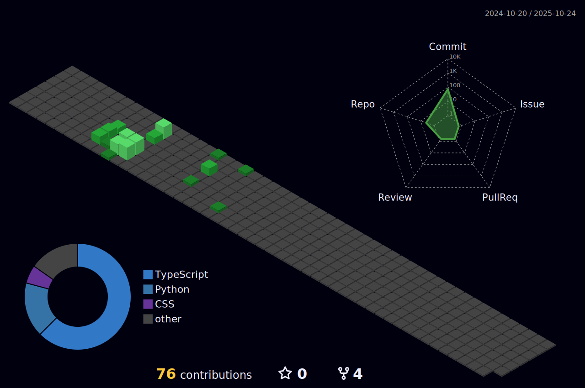

<!--## Hi there 👋

**MrEntity303/mrentity303** is a ✨ _special_ ✨ repository because its `README.md` (this file) appears on your GitHub profile.

Here are some ideas to get you started:

- 🔭 I’m currently working on ...
- 🌱 I’m currently learning ...
- 👯 I’m looking to collaborate on ...
- 🤔 I’m looking for help with ...
- 💬 Ask me about ...
- 📫 How to reach me: ...
- 😄 Pronouns: ...
- ⚡ Fun fact: ...

-->
# Developer | Passionate about IT Technologies and Problem-Solving

Hi there 👋! I'm Patryk Bialowas, a Developer with a deep passion for building scalable web applications and solving problems. I specialize in both frontend and backend development and enjoy working with modern technologies to create solutions. 🚀

---

## 🔧 Technologies & Tools

I love working with a variety of technologies. Here’s a list of the main ones I use daily:

### Frontend:
- **HTML5** | **CSS3** | **JavaScript**
- **React.js** | **Vue.js**
- **TailwindCSS** | **Bootstrap**
- **TypeScript**
- **Next.js**

### Backend:
- **Node.js** | **Express.js**
- **Python**
- **Java Spring Boot**

### Databases:
- **MongoDB**
- **MySQL**
- **SQLite**

### DevOps:
- **Docker**
- **CI/CD** with **GitHub Actions**
- **Apache**

### Version Control:
- **Git** | **GitHub**

---

## 💻 What I Do

- **Building Scalable Applications**: From the frontend UI to the backend API.
- **Problem-Solving**: I love tackling difficult challenges and creating efficient solutions through clean, maintainable code.
- **Collaborative Development**: I thrive in collaborative environments and enjoy contributing to open-source projects and working with teams to create amazing products.
- **Continuous Learning**: Technology evolves fast, and I always keep myself updated with the latest trends and best practices in software development.

---

## 📫 Get in Touch

Feel free to reach out if you want to collaborate on exciting projects, share knowledge, or just chat about tech!

- **Email**: [bialowas.patryk@libero.it](mailto:bialowas.patryk@libero.it)
- **LinkedIn**: [linkedin.com/in/patryk-bialowas](https://www.linkedin.com/in/patryk-sebastian-bialowas-95a48a309/)
- **GitHub**: [github.com/mrentity303](https://github.com/mrentity303)

---

Thanks for checking out my profile! 🚀

